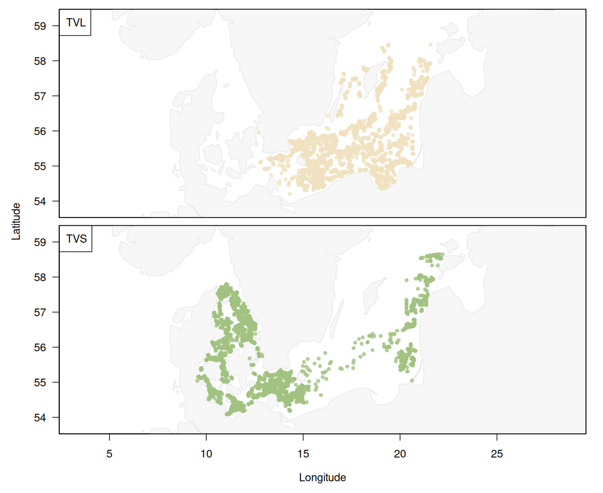
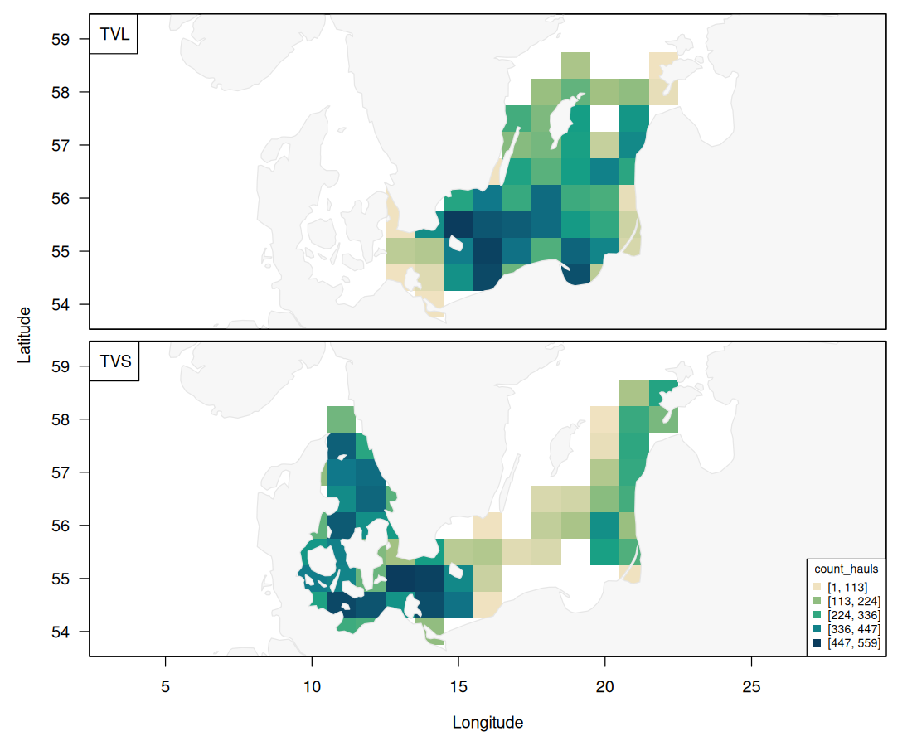
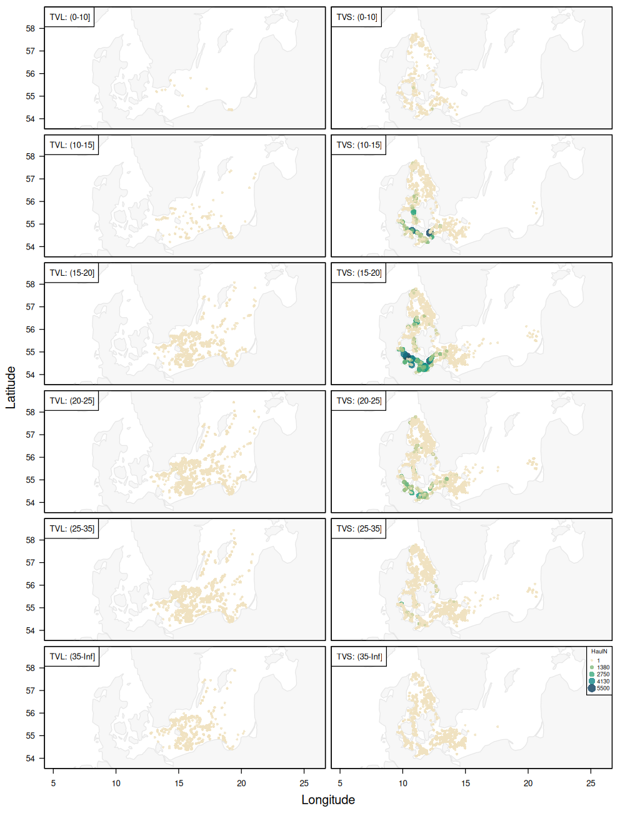

# Gear efficiency: TVL vs. TVS for plaice in the Baltic

| Field        | Value                               |
|--------------|-------------------------------------|
| Author       | Tobias Mildenberger and Casper Berg |
| Email        | tobm@dtu.dk and cabe@dtu.dk         |
| Version      | 2.0                                 |
| Last updated | 2026-06-14                          |

## Methodological challenge

Survey data are often collected using multiple vessels and gear types.
Differences in gear efficiency can introduce systematic biases into abundance
indices, species distribution models, and trend analyses.

In this dataset, all observations originate from the same survey but two
different gears: a large TV trawl (TVL) and a small TV trawl (TVS) (Fig. 1).

The spatial distribution of the numbers of hauls by gear is shown in Fig. 2.

Combining observations obtained by different gears is important when working
with ICES DATRAS. Can we assume that swept area accounts for all differences or
might there still be important unaccounted differences between gears that we
should account for? This data set could serve as an exploration of this
question. Specific questions could be:

* How does the catch efficiency differ among TVL and TVS?
* When can gear efficiency be estimated reliably?
* When do gear estimates reflect spatial differences and when gear efficiencies?
* Does gear efficiency differ by length?

## Data sources

* **Source:** ICES DATRAS
* **Survey type:** Baltic International Trawl Survey (BITS)
* **Years:** 1999–2024
* **Taxonomic scope:** Plaice (Pleuronectes platessa)
* **Response variables:**

  * Numbers-at-length per haul
  * Weight-at-length per haul

## Key variables

| Variable     | Unit             | Description                                                                               |
|--------------|------------------|-------------------------------------------------------------------------------------------|
| haul.id      | —                | Unique identifier for each survey haul. Repeated across length groups from the same haul. |
| Survey       | —                | DATRAS survey programme identifier, e.g. `BITS`.                                          |
| Gear         | —                | Survey gear identifier, e.g. `TVL`.                                                       |
| Country      | —                | Country code for the institute or vessel conducting the haul.                             |
| Ship         | —                | Survey vessel code.                                                                       |
| Year         | year             | Year in which the haul was conducted.                                                     |
| Quarter      | quarter          | Calendar quarter of the survey, from 1 to 4.                                              |
| Month        | month            | Calendar month of the haul, from 1 to 12.                                                 |
| Day          | day              | Day of month on which the haul was conducted.                                             |
| lon          | decimal degrees  | Haul longitude in WGS84.                                                                  |
| lat          | decimal degrees  | Haul latitude in WGS84.                                                                   |
| timeOfYear   | fraction of year | Within-year timing of the haul, expressed as fraction of the year.                        |
| abstime      | year             | Continuous decimal-year time variable, approximately `Year + timeOfYear`.                 |
| DayNight     | —                | Day/night category of the haul; `D` = day, `N` = night.                                   |
| TimeShotHour | hour of day      | Haul start time as decimal hour, e.g. `14.5` = 14:30.                                     |
| HaulDur      | minutes          | Duration of the haul.                                                                     |
| SweptArea    | m²               | Estimated swept area of the haul.                                                         |
| LengthGroup  | cm               | Fish length interval, e.g. `(20-25]` cm.                                                  |
| HaulN        | number           | Number of fish observed in the haul and length group.                                     |
| HaulWgt      | g                | Total weight of fish observed in the haul and length group.                               |

Detailed information about many of these columns can also be downloaded as an
excel table from the [ICES
webpage](https://www.ices.dk/data/Documents/DATRAS/DATRAS_Field_descriptions_and_example_file_December2025.xlsx).

## Assumptions

1. Species identification is correct.
2. Position and sampling metadata are accurate.
4. Environmental effects are either negligible or can be modelled separately.
5. Differences among gears reflect differences in catchability rather than stock
   abundance.

