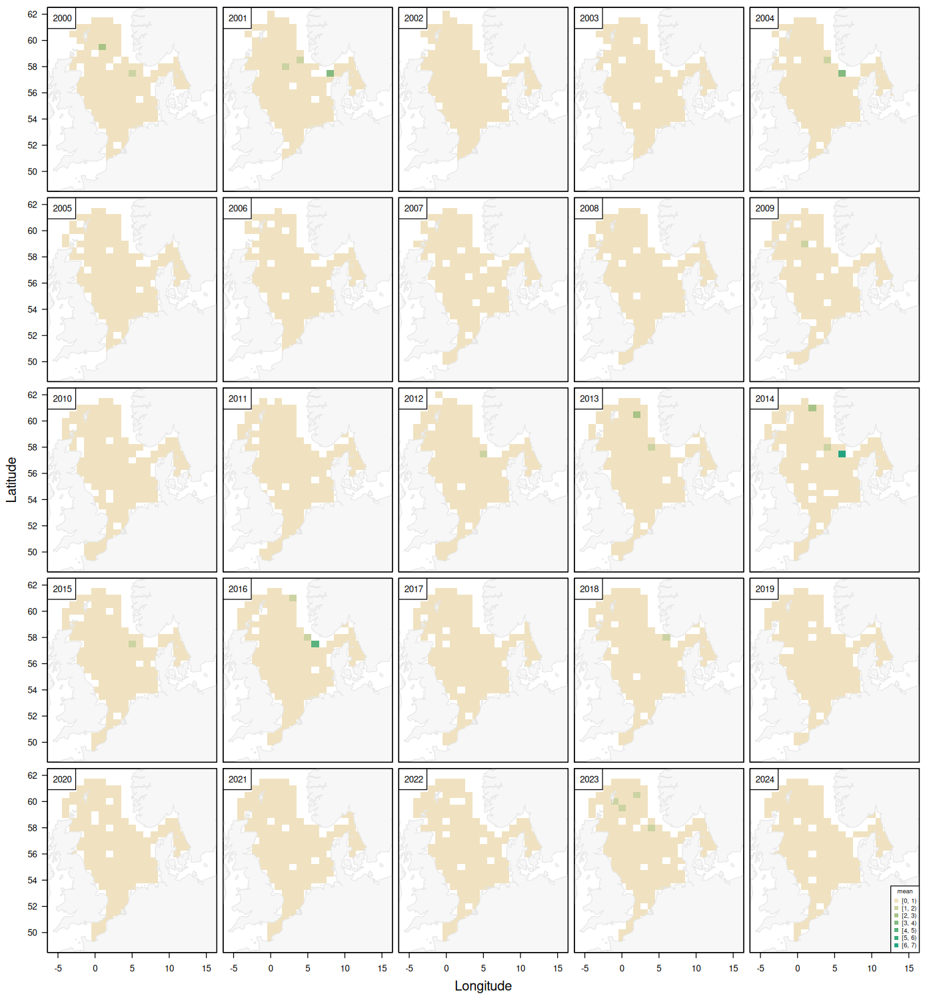
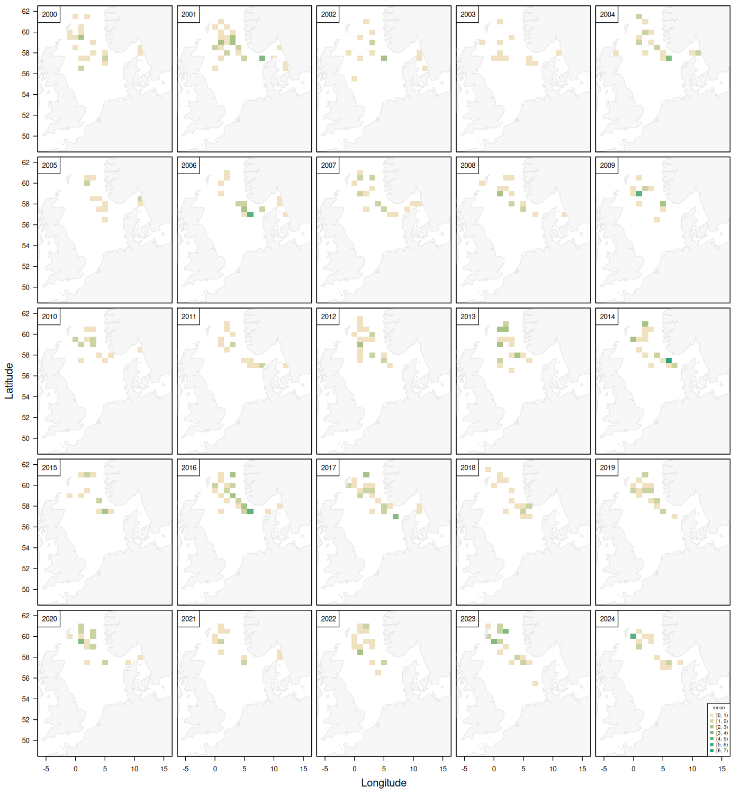

# Unnecessary zeros: Can we remove zeros without losing information?

| Field        | Value                               |
|--------------|-------------------------------------|
| Author       | Tobias Mildenberger and Casper Berg |
| Email        | tobm@dtu.dk and cabe@dtu.dk         |
| Version      | 2.0                                 |
| Last updated | 2026-06-14                          |

## Methodological challenge

Many species occupy only a subset of the habitats sampled by large-scale
monitoring surveys. As a result, survey datasets often contain large numbers of
zero observations from areas that may never be suitable habitat for the species
of interest. These observations increase dataset size and computational
requirements, particularly when fitting spatial and spatiotemporal models.

A common question is whether such "structural zeros" can be removed without
affecting inference. Removing observations from consistently unsuitable habitats
may substantially reduce model fitting times, but it may also discard
information about habitat boundaries, occupancy, and the processes governing
species distributions.

This dataset contains observations of Atlantic wolffish (*Anarhichas lupus*)
from the North Sea International Bottom Trawl Survey (NS-IBTS) between 2000
and 2024. Wolffish has a restricted distribution within the survey area and is
absent from large parts of the North Sea, resulting in a high proportion of zero
catches (Figure 1).

Restricting the dataset to positive catches highlights the species' core
distribution and potential habitat (Figure 2).

### Questions to explore

* Can observations from areas with persistent zero catches be removed without
  affecting model predictions?
* How much can computation time be reduced by removing zero observations?
* Do parameter estimates, uncertainty estimates, or predictive performance
  change when zeros are removed?
* Can structural zeros be distinguished from sampling zeros using environmental
  covariates or spatial models?
* What are the consequences for estimating species distributions, habitat
  suitability, and occupied area?

## Data sources

* **Source:** ICES DATRAS
* **Survey:** North Sea International Bottom Trawl Survey (NS-IBTS)
* **Years:** 2000–2024
* **Species:** Atlantic wolffish (*Anarhichas lupus*)
* **Response variables:**

  * Number of fish per haul
  * Total weight per haul

## Key variables

| Variable     | Unit             | Description                                                          |
| ------------ | ---------------- | -------------------------------------------------------------------- |
| haul.id      | —                | Unique identifier for each survey haul.                              |
| Survey       | —                | DATRAS survey programme identifier.                                  |
| Gear         | —                | Survey gear identifier.                                              |
| Country      | —                | Country code of the survey institute or vessel.                      |
| Ship         | —                | Survey vessel code.                                                  |
| Year         | year             | Year in which the haul was conducted.                                |
| Quarter      | quarter          | Calendar quarter of the survey (1–4).                                |
| Month        | month            | Calendar month of the haul (1–12).                                   |
| Day          | day              | Day of month on which the haul was conducted.                        |
| lon          | decimal degrees  | Haul longitude (WGS84).                                              |
| lat          | decimal degrees  | Haul latitude (WGS84).                                               |
| timeOfYear   | fraction of year | Timing of the haul within the year.                                  |
| abstime      | year             | Continuous decimal-year variable, approximately `Year + timeOfYear`. |
| DayNight     | —                | Day/night category of the haul (`D` = day, `N` = night).             |
| TimeShotHour | hour of day      | Haul start time as decimal hour.                                     |
| HaulDur      | minutes          | Duration of the haul.                                                |
| SweptArea    | m²               | Estimated swept area of the haul.                                    |
| HaulN        | number           | Number of Atlantic wolffish caught in the haul.                      |
| HaulWgt      | g                | Total weight of Atlantic wolffish caught in the haul.                |

Detailed information about many of these columns can also be downloaded as an
excel table from the [ICES
webpage](https://www.ices.dk/data/Documents/DATRAS/DATRAS_Field_descriptions_and_example_file_December2025.xlsx).

## Assumptions

1. Species identifications are correct and consistent throughout the time
   series.
2. Haul positions and associated sampling metadata are accurate.
3. Survey catchability is sufficiently constant through time for distributional
   patterns to be interpreted biologically.
4. Zero catches in persistently unoccupied areas may represent unsuitable
   habitat rather than temporary absences.
5. The period 2000–2024 adequately captures the contemporary distribution of
   Atlantic wolffish in the North Sea.
