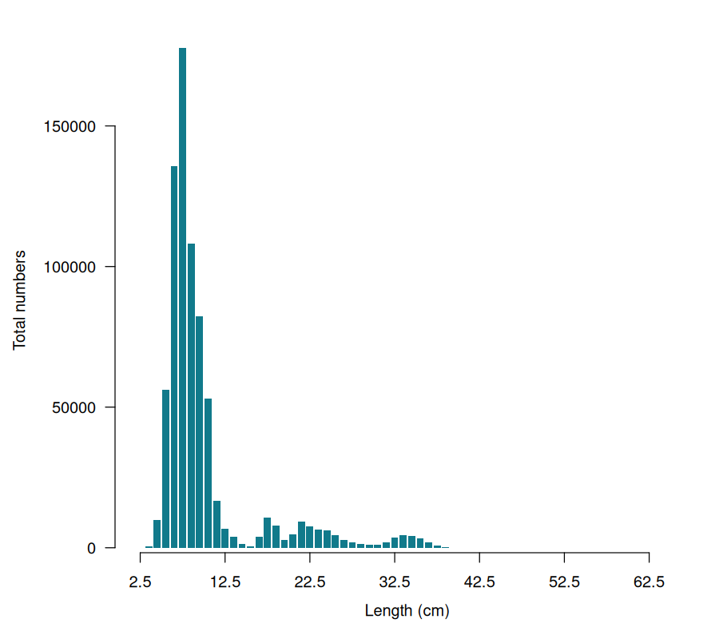
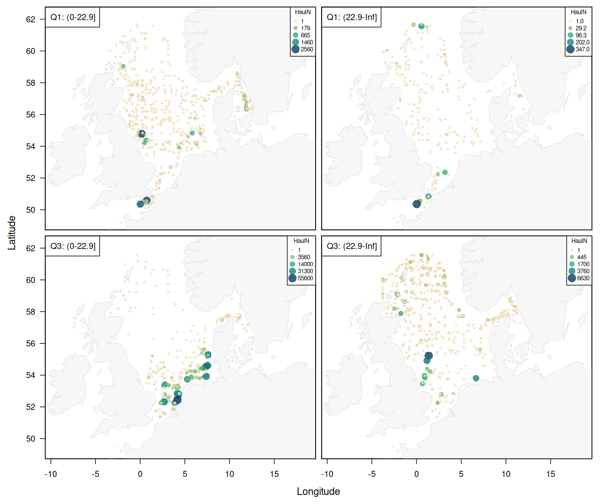
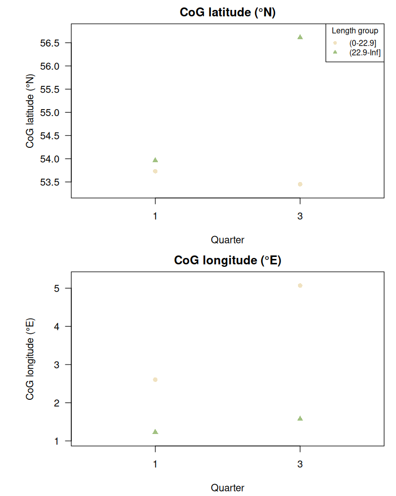

# Can one model fit all seasons?

| Field        | Value                               |
|--------------|-------------------------------------|
| Author       | Tobias Mildenberger and Casper Berg |
| Email        | tobm@dtu.dk and cabe@dtu.dk         |
| Version      | 2.0                                 |
| Last updated | 2026-06-14                          |

## Methodological challenge

Many species exhibit seasonal movements between habitats associated with
spawning, feeding, overwintering, or ontogenetic shifts. As a result, species
distributions may vary substantially throughout the year. Ignoring seasonal
changes in distribution can lead to biased estimates of habitat suitability,
inaccurate prediction maps, and misleading conclusions regarding
species-environment relationships.

This dataset contains observations of horse mackerel (*Trachurus trachurus*)
from the North Sea International Bottom Trawl Survey (NS-IBTS) between 2022
and 2025. Horse mackerel is a mobile species that undergoes pronounced seasonal
changes in distribution and habitat use. The survey catches span a wide range of
body sizes, from 2.5 to 62.5 cm (Figure 1).

To illustrate potential ontogenetic differences in seasonal movement patterns,
observations were divided into juvenile and adult fish using length at 50%
maturity as a threshold. Catch rates differ substantially among seasons,
regions, and life stages (Figure 2).

Seasonal shifts are also evident in the latitudinal centre of gravity of adult
fish, indicating large-scale seasonal movements within the survey area (Figure
3).

These patterns raise important questions regarding the treatment of seasonality
in species distribution models.

### Questions to explore

* Can a single SDM adequately describe species distributions throughout the year?
* How much predictive performance is gained by explicitly accounting for
  seasonality?
* Do habitat preferences remain constant throughout the year, or do
  species-environment relationships change seasonally?
* Should season be included as a covariate, or should separate seasonal models be fitted?
* Can seasonal movements be captured using smooth temporal effects?
* Do juveniles and adults exhibit similar seasonal distribution patterns?
* How does ignoring seasonal variation affect estimates of habitat suitability,
  occupancy, and distribution shifts?

## Data sources

* **Source:** ICES DATRAS
* **Survey:** North Sea International Bottom Trawl Survey (NS-IBTS)
* **Years:** 2022–2025
* **Quarter:** 1, 3
* **Gear:** GOV
* **Species:** Horse mackerel (*Trachurus trachurus*)
* **Response variables:**

  * Numbers-at-length per haul
  * Weight-at-length per haul

## Key variables

| Variable     | Unit             | Description                                                          |
|--------------|------------------|----------------------------------------------------------------------|
| haul.id      | —                | Unique identifier for each survey haul.                              |
| Survey       | —                | DATRAS survey programme identifier.                                  |
| Gear         | —                | Survey gear identifier.                                              |
| Country      | —                | Country code of the survey institute or vessel.                      |
| Ship         | —                | Survey vessel code.                                                  |
| Year         | year             | Year in which the haul was conducted.                                |
| Quarter      | quarter          | Calendar quarter of the survey (1–4).                                |
| Month        | month            | Calendar month of the haul (1–12).                                   |
| Day          | day              | Day of month on which the haul was conducted.                        |
| lon          | decimal degrees  | Haul longitude (WGS84).                                              |
| lat          | decimal degrees  | Haul latitude (WGS84).                                               |
| timeOfYear   | fraction of year | Timing of the haul within the year.                                  |
| abstime      | year             | Continuous decimal-year variable, approximately `Year + timeOfYear`. |
| DayNight     | —                | Day/night category of the haul (`D` = day, `N` = night).             |
| TimeShotHour | hour of day      | Haul start time as decimal hour.                                     |
| HaulDur      | minutes          | Duration of the haul.                                                |
| SweptArea    | m²               | Estimated swept area of the haul.                                    |
| LengthGroup  | cm               | Fish length interval, e.g. `(20-25]` cm.                             |
| HaulN        | number           | Number of horse mackerel caught in the haul.                         |
| HaulWgt      | g                | Total weight of horse mackerel caught in the haul.                   |

Detailed information about many of these columns can also be downloaded as an
excel table from the [ICES
webpage](https://www.ices.dk/data/Documents/DATRAS/DATRAS_Field_descriptions_and_example_file_December2025.xlsx).

## Assumptions

1. Species identifications are correct and consistent throughout the time
   series.
2. Haul positions and associated sampling metadata are accurate.
3. Survey catchability is sufficiently constant through time for distributional
   patterns to be interpreted biologically.
4. Seasonal differences in survey timing are sufficiently consistent among years
   to allow meaningful comparison of seasonal distributions.
5. Length at 50% maturity provides a reasonable proxy for separating juvenile
   and adult fish.
5. The observed spatial distribution is representative of the species'
   underlying distribution during the study period.
